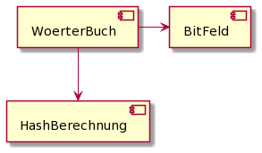

= Softwareentwicklung im Team: Praktische Übung 1
:icons: font
:icon-set: fa
:experimental:
:source-highlighter: rouge
ifdef::env-github[]
:tip-caption: :bulb:
:note-caption: :information_source:
:important-caption: :heavy_exclamation_mark:
:caution-caption: :fire:
:warning-caption: :warning:
:stem: latexmath
endif::[]

== Vorbereitung 

Die Vorbereitungsarbeiten müssen Sie *vor der praktischen Übung* abschließen. 

Wir erwarten von Ihnen, dass Sie ...

* folgendes kurzes Video zu https://www.youtube.com/watch?v=kfFacplFY4Y[Bloom Filtern] angesehen haben
* git und mob auf Ihrem Rechner installiert haben. Probieren Sie beide Werkzeuge aus, indem Sie `git --version` bzw. `mob --version` in Ihrem Terminal aufrufen.
* eine IDE installiert haben. Wir empfehlen IntelliJ IDEA oder Eclipse. 
* ein Headset o.ä. bereithalten. Testen Sie Ihr Audiosetup mit anderen Kommilitonen (z.B. Ihrer Gruppe) aus. Sie können dazu zum Beispiel https://test.bigbluebutton.org/ benutzen. 
* den Aufgabentext unten gelesen und sich dazu schon Gedanken gemacht haben 

== Ziele der Übung

Diese Übung dient hauptsächlich dazu, sich mit dem Tooling, das wir verwenden werden vertraut zu machen. Dazu gehören eine Software zur Videokonferenz und Screen-Sharing, die IDE und das mob Werkzeug. Um das Handover mit `mob` einzuüben, werden Sie ca. alle 5 Minuten den Driver wechseln. Die TutorInnen werden dabei helfen, die Zeiten einzuhalten. 

== Ablauf der Übung

. Schalten Sie *mindestens* das Mikrofon, aber besser auch die Kamera, ein 
. Am Anfang gibt es eine kurze Vorstellungsrunde 
. In der Gruppe wird kurz diskutiert, wie die Lösung angegangen werden soll und es werden noch offene Fragen geklärt
. Es wird festgelegt, in welcher Reihenfolge die "Driver" Rolle übernommen wird
. Die erste Person teilt Ihren Screen und übernimmt mithilfe von `mob` die Session
. Es wird an der Problemstellung gemeinsam gearbeitet nach den Regeln des Mob Programmings 
. Nach ca. der Hälfte der Zeit gibt es ein Feedback durch die Tutorin oder den Tutor
. Es wird weiter an der Problemstellung gearbeitet
. ca. 10 Minuten vor Ende der Session bekommen Sie Ihre Abschlussbewertung 

NOTE: In dieser ersten praktischen Übung wird die Abschlussbewertung nicht für die Zulassung gewertet. 

== Aufgabe 

Wir wollen einen Bloomfilter schreiben, mit dessen Hilfe wir ein speichereffizientes Wörterbuch für eine Rechtschreibkorrektur implementieren wollen. 

=== Struktur der Anwendung

Die Anwendung soll folgendermaßen strukturiert sein:

*Bitfeld* 
Das Bitfeld dient als Schnittstelle zu den einzelnen Bits. Die Komponente stellt Methoden zum Setzen und Lesen der einzelnen Bits zur Verfügung. Der Zugriff erfolgt über den Index des Bits. 

*Hashberechnung*
In der HashBerechnung-Komponente werden für einen Eingabestring die unabhängigen Hashwerte berechnet. Sie brauchen also vermutlich eine Methode, die den Eingabestring und irgendeine Form von Identifizierer (z.B. eine Nummer) für die Hashfunktion bekommt. 

*Wörterbuch*
Das Wörterbuch ist die Hauptkomponente des Programms und verwendet die beiden anderen Komponenten um unser Wörterbuch zu implementieren. Es sollten also hier zumindest Methoden vorhanden sein, um ein Wort im Bloomfilter zu speichern und zu prüfen, ob das Wort vorhanden ist. 

=== Tests
Schreiben Sie Tests, um zu überprüfen, dass die Anwendung funktioniert. Überlegen Sie sich, welche Eigenschaften getestet werden müssen und wie Sie das machen können. Achten Sie darauf, dass Sie nicht überspezifizieren, d.h. testen Sie keine Implementierungsdetails, sondern das Verhalten an den Komponentengrenzen.

JUnit 5, AssertJ und Mockito sind bereits im Buildfile inkludiert.  

=== Parametrisierung
Der Bloomfilter soll parametrisiert sein, mit folgenden Parametern:

* Die Anzahl `n` der Bits, die verwendet werden sollen. Die Größe `n` soll in Potenzen von 256 angegeben werden. Wenn wir die Größe `n = 2` verwenden, dann bedeutet das, dass wir 65536 als Größe des Bitfeldes verwenden. Daraus ergibt sich als Konsequenz, dass die Hashfunktion entsprechende viele Bytes als Ergebnis liefern muss. In unserem Beispiel benötigen wir also 2 Bytes.
* Die Anzahl `m` an Hashfunktionen. Diese Zahl muss mindestens 1 und höchstens 20/n (int Division) sein.

=== Hinweise zur Implementierung
Wir verwenden die SHA1 Hashfunktion, die wir ja schon bei git kennengelernt haben. Ein SHA1 Hashwert hat immer genau 20 Bytes, die hinreichend unabhängig voneinander sind, wir können also unsere Hashfunktionen durch Verwendung von Teilen des SHA1 Hashwertes erzeugen. Wenn wir beispielsweise  n = 2 und m = 3 gewählt haben, dann berechnen wir den SHA1 Hash der Eingabe (das gibt insgesamt 20 Byte) und wählen zum Beispiel die ersten zwei Bytes um das erste Bit im Bloomfilter zu wählen, die nächsten 2 Byte für das zweite Bit und die nächsten 2 Byte für das dritte Bit.

Um die Berechnung des SHA1 Hashwerts zu vereinfachen ist im Gradle Buildfile bereits die Bibliothek "Apache Commons Codec" inkludiert, die die Berechnung ziemlich einfach macht:

[source, java]
----
byte[] bytes = DigestUtils.sha1(word);
----

WARNING: Denken Sie daran, dass `byte` in Java vorzeichenbehaftet (signed) ist (d.h. wenn Sie damit rechnen, hat ein Byte einen Wert zwischen -128 und 127). Um einen Index für einen Bloomfilter zu berechnen werden aber (positive) unsigned Werte benötigt. In Java können Sie zum Beispiel `int unsigned = signed & 0xFF` verwenden, um ein unsigned Byte in einer Integer-Variablen zu speichern. 

== Verhaltensregeln

Wir erwarten von Ihnen einen respektvollen Umgang miteinander. Es gilt grundsätzlich bei uns der https://berlincodeofconduct.org/de/[Berlin Code of Conduct]. Die TutorInnen haben die Aufgabe, die Einhaltung der Regeln zu überwachen und können bei Verstößen gegen den Verhaltenskodex Personen aus der praktischen Übung entfernen.   